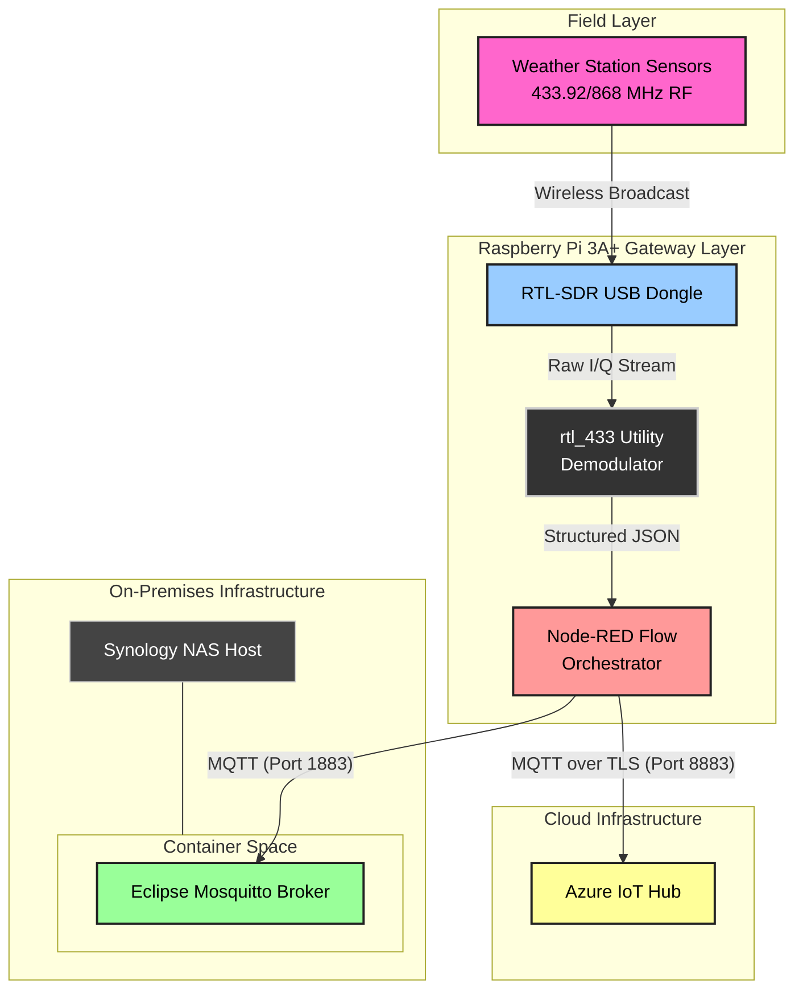

# SDRGateway

   
  <em>Figure 1: My Raspberry Pi 3A+ setup running headless.</em>

## System Architecture

### Data Pipeline & Architecture Layers

1. **Physical / RF Layer:** Wireless outdoor weather sensors broadcast raw radio frequencies.
2. **SDR Hardware Ingestion:** An RTL-SDR USB dongle attached to the Raspberry Pi 3A+ intercepts the 433/868MHz signals.
3. **Demodulation Layer:** The `rtl_433` tool runs on Raspberry Pi OS, decoding the radio signals into structured JSON data.
4. **Edge Orchestration:** Node-RED ingests the JSON payload, parses the telemetry, and splits the data stream into two pathways:
   * **Local Storage:** Dispatched to a containerised Eclipse Mosquitto broker on a Synology NAS via MQTT.
   * **Cloud Storage:** Secured and dispatched to Azure IoT Hub for enterprise cloud processing.

