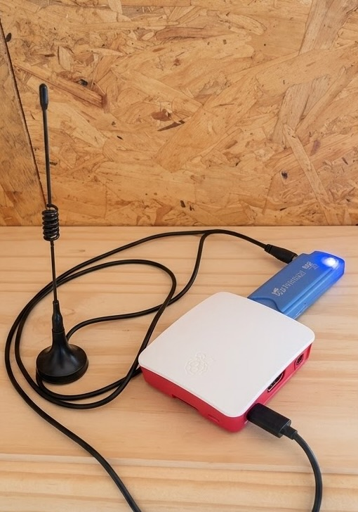
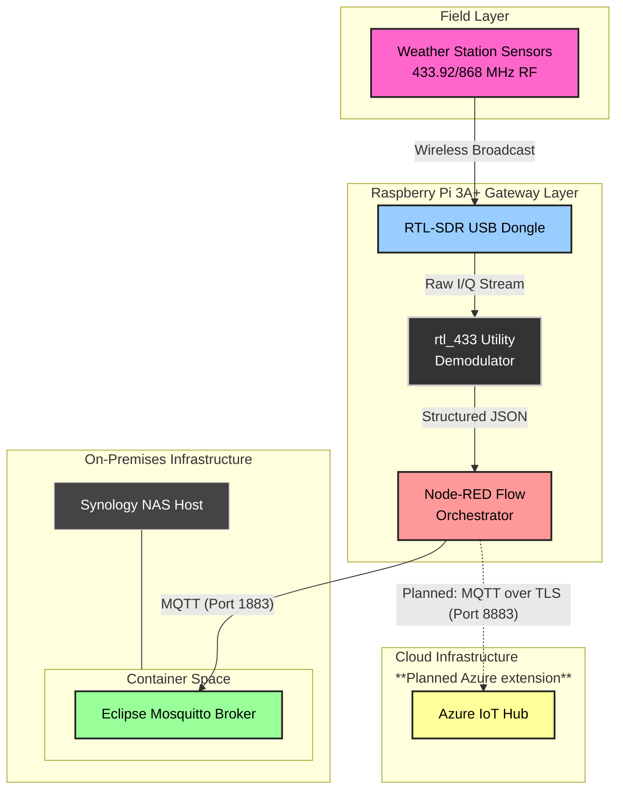
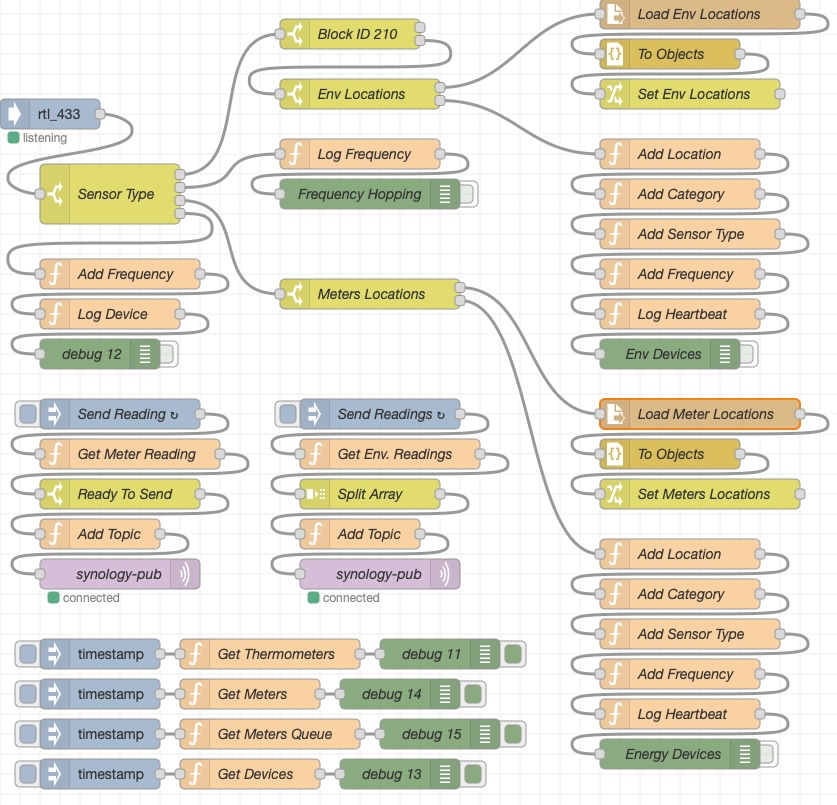

# SDRGateway

**SDRGateway** is an edge data collector running on a headless Raspberry Pi 3A+ (figure 1). It collects and decodes 433MHz/868MHz ISM telemetry data from a weather station and energy meters, enriches it with metadata and publishes MQTT messages to the central broker.</br>
It uses [rtl_433](https://github.com/merbanan/rtl_433) which decodes traffic broadcasted by 433MHz/868MHz devices and collected by an SDR dongle attached to the Raspberry Pi.</br>
The program is accessed by a Node-RED node [node-red-contrib-rtl_433](https://github.com/dayne/node-red-contrib-rtl_433/blob/master/README.md) which sends the JSON formatted messages to the Node-RED flow for filtering, formatting and enriching with metadata before it is being sent in a form of MQTT messages to the central broker.

<p align="center">
  <br>
  <em>Figure 1: Raspberry Pi 3A+ with RTL-SDR dongle and antenna.</em>
</p>

## System Architecture


<em>Figure 2: System Architecture.</em>

### Data Pipeline & Architecture Layers

1. **Physical / RF Layer:** Wireless outdoor weather sensors broadcast raw radio frequencies.
2. **SDR Hardware Ingestion:** An RTL-SDR USB dongle attached to the Raspberry Pi 3A+ intercepts the 433MHz/868MHz signals.
3. **Demodulation Layer:** The [rtl_433](https://github.com/merbanan/rtl_433) tool runs on Raspberry Pi OS, decoding the radio signals into structured JSON data.
4. **Edge Orchestration:** Node-RED ingests the JSON payload, parses the telemetry, and splits the data stream into two pathways:
   * **Local Storage:** Dispatched to a containerised Eclipse Mosquitto broker on a Synology NAS via MQTT.
   * **Cloud Storage:** Secured and dispatched to Azure IoT Hub for enterprise cloud processing. This pathway is a planned future extension.

### Node-RED Flow

<p align="center">
  <br>
  <em>Figure 3: The Node-RED flow.</em>
</p>

Example MQTT message sent to the central broker:
Topic: demo-house/garden/meteo/Fineoffset-.../123
Message payload: "{"id":123,"model":"Fineoffset-...","last_logged":"2026-09-02T16:39:59.899Z","tempc":18.7,"hum":77,"battery_ok":1,"category":"meteo","house":"demo-house","room":"garden","type":"weather_station","wind_dir_deg":251,"wind_avg_m_s":3.36,"wind_max_m_s":4.48,"rain_mm":508.2,"uv":61,"uvi":0,"light_lux":8099,"frequency":"868.000MHz"}"

### Prerequisites / Deploy

1. **Hardware:** Raspberry Pi 3A+ quite comfortably runs the rtl_433 program and Node-RED. SDR dongles differ in price but for this project a simple one is enough.
2. **Software:** Node-RED with project dependencies installed from package.json. Please note that [rtl_433](https://github.com/merbanan/rtl_433) needs to be installed as described in [node-red-contrib-rtl_433](https://github.com/dayne/node-red-contrib-rtl_433/blob/master/README.md).
3. **Python helper:** `mem.py` reports memory usage for the Node-RED health dashboard. Install its dependency:

    ```bash
    sudo apt install python3-psutil
    ```

### Reliability & Security

The traffic coming from rtl_433 node is filtered based on the known sensor list. Once the message is properly recognised, formatted and enriched with metadata, it is sent to the central broker with QoS of 1 which means it is delivered at least once. The message is timestamped which helps with spotting potential duplicates.</br>
</br>
There are two template files called sensors-env.example.json and meters.example.json. They are templates for providing a list of known environmental sensors and energy monitors respectively including their locations. They should be renamed to sensors-env.json and meters.json and contain data relevant for each deployment. Local settings and credential files like flows_cred.json have been included in .gitignore so they are not accidentally committed.